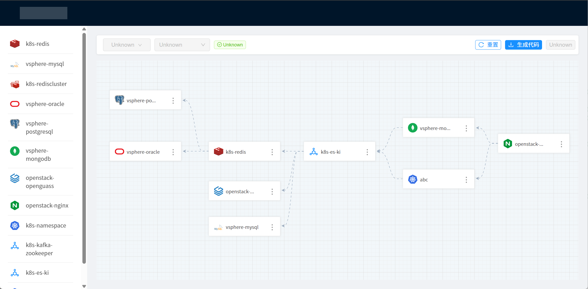

# Terraform Graph

<div id="tags">


<a href="https://1x.antdv.com/docs/vue/getting-started-cn/"></a>


</div>

> Terraform 代码可视化建模工具




## 快速开始

```shell
npm install
npm run serve
```

## 更新日志

2025/5/13

- 加入示例代码中的所有 module。